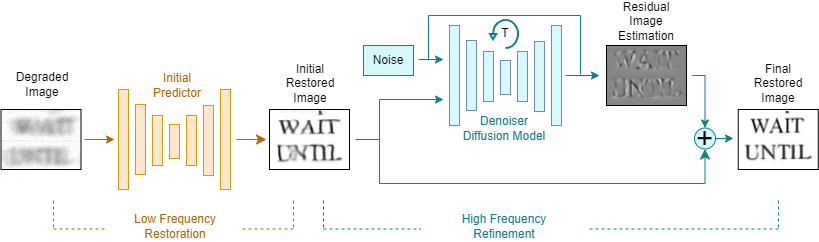

<div align="center">

 

</div>

<div align="center">


# NAF-DPM:  Nonlinear Activation-Free Diffusion Probabilistic Model for Document Enhancement

> [**NAF-DPM:  Nonlinear Activation-Free Diffusion Probabilistic Model for Document Enhancement**](https://arxiv.org/abs/2404.05669)<br>
> [Giordano Cicchetti](https://www.linkedin.com/in/giordano-cicchetti-1ab73b258/), [Danilo Comminiello](https://scholar.google.com/citations?user=H3Y52cMAAAAJ&hl=en)


This is the official repository for the paper [NAF-DPM: A Nonlinear Activation-Free Diffusion Probabilistic Model for Document Enhancement](https://arxiv.org/abs/2404.05669). NAF-DPM is a novel generative framework based on DPMs that solves document enhancement tasks
by treating them as a conditional image-to-image translation problem. It can be used for tasks such as document deblurring, denoising, binarization, etc.
Actually paper under review at IEEE Transactions on Pattern Analysis and Machine Intelligence.

[](https://arxiv.org/abs/2404.05669)

</div>


Binarization results:


[](https://paperswithcode.com/sota/binarization-on-dibco-2019?p=naf-dpm-a-nonlinear-activation-free-diffusion)
[](https://paperswithcode.com/sota/binarization-on-dibco-2017?p=naf-dpm-a-nonlinear-activation-free-diffusion)

<hr />

## Highlights

**<p align="justify"> Abstract:** *Real-world documents often suffer from various forms of degradation, which can lead to lower accuracy in optical character recognition (OCR) systems. Therefore, a crucial preprocessing step is essential to eliminate noise while preserving text and key features of the documents. In this paper, we propose a novel generative framework based on a diffusion probabilistic model (DPM) designed to restore the original quality of degraded documents. While DPMs are recognized for their high-quality generated images, they are also known for their large inference time. To mitigate this problem, we address both the architecture design and sampling strategy. To this end, we provide the DPM with an efficient nonlinear activation-free (NAF) network, which also proves to be very effective in image restoration tasks. For the sampling strategy, we employ a fast solver of ordinary differential equations, which is able to converge in 20 iterations at most. The combination of a small number of parameters (only 9.4M), an efficient network and a fast sampling strategy allow us to achieve competitive inference time with respect to existing methods.
To better preserve text characters, we introduce an additional differentiable module based on convolutional recurrent neural networks (CRNN) simulating the behavior of an OCR system during the training phase. This module is used to compute an additional loss function that better guides the diffusion model to restore the original quality of the text in document images. 
Experiments conducted on diverse datasets showcase the superiority of our approach, achieving state-of-the-art performance in terms of both pixel-level metrics %(PSNR and SSIM) 
and perceptual similarity metrics% (LPIPS and DISTS)
. Furthermore, the results demonstrate a notable error reduction by OCR systems when transcribing real-world document images enhanced by our framework.* </p>

<hr />

## Results
### NAF-DPM in comparison with existing methods
Results reported below show performance of different methods on the Blurry Document Images OCR Text Dataset (https://www.fit.vutbr.cz/~ihradis/CNN-Deblur/) for PSNR, SSIM, LPIPS, DISTS and CER metrics .

| Name                                                      | PSNR | SSIM |   LPIPS    | DISTS | CER |
|-----------------------------------------------------------|:---------:|:----------:|:---------:|:------:|:------:|
| [Hradis](https://library.utia.cas.cz/separaty/2015/ZOI/kotera-0450667.pdf) |   30.629   |   0.987    |   0.0135   |   0.0258    |  5.44 |
| [DE-GAN](https://arxiv.org/abs/2010.08764)                  | 28.803 |   0.985    |  0.0144   | 0.0237   | 6.87 |
| [DocDiff](https://arxiv.org/abs/2305.03892) |   29.787   |   0.989    |   0.0094   |   0.0339   | 2.78 
| [NAF-DPM (ours)](link)  |   **34.377**   | **0.994**  | **0.0046** |   **0.0228**    | **1.55** |

<hr />

Results reported below show performance of different methods on DIBCO2019 for PSNR, F-Measure and Pf-measure metrics.

| Name                                                      | PSNR | F-Measure |   Pf-Measure 
|-----------------------------------------------------------|:---------:|:----------:|:---------:|
| [Otsu] |   9.08   |   47.83    |   45.59   |
| [Sauola]  | 13.72 |   51.73    |  55.15   |
| [Competition_Top] |   14.48   |   72.88    |   72.15   |   
| [DE-GAN] |   12.29   |   55.98    |   53.44   |    
| [D^2BFormer] |   15.05   |   67.63    |   66.69   |  
| [DocDiff] |   15.14   |   73.38    |   75.12   |   
| [NAF-DPM (ours)](link) |   **15.39**   | **74.61**  | **76.25** |


# Installation


This codebase is tested on Ubuntu 22.04 LTS with python 3.12.1 Follow the below steps to create environment and install dependencies

* Setup conda environment (recommended).
```bash
# Create a conda environment
conda create -y -n NAFDPM python=3.12.1

# Activate the environment
conda activate NAFDPM

# Install torch (requires version >= 1.8.1) and torchvision
# Please refer to https://pytorch.org/ if you need a different cuda version
pip3 install torch torchvision torchaudio

```

* Clone NAFDPM code repository and install requirements
```bash
# Clone NAFDPM code base
git clone https://github.com/Giordano-Cicchetti/Diffusion-Document-Enhancement.git

cd Diffusion-Document-Enhancement/
# Install requirements

pip install -r requirements.txt

```

# Data Preparation

## BMVC Blurry Document Images Text Dataset
- Create folder dataset_deblurring
- Download the training data from the [official website](https://www.fit.vutbr.cz/~ihradis/CNN-Deblur/) and extract the data in the created folder.
- Use the script in the folder utils/prepare_deblurring_dataset.py to divide data into training and validation. Please if necessary change the variables referring to paths into utils/prepare_deblurring_dataset.py


The directory structure should look like
```
dataset_deblurring/
   |–– train_origin/ #Contains 30000 origin images
   |–– train_blur/ #Contains 30000 blurry images
   |–– test_origin/ #Contains 10000 origin images
   |–– test_blur/ #Contains 10000 blurry images
```

## DIBCO 

- We gathered the DIBCO, H-DIBCO, Bickley Diary dataset, Persian Heritage Image Binarization
Dataset (PHIDB), the Synchromedia Multispectral dataset
(S-MS)  and Palm Leaf dataset (PALM) and organized them in one folder. You can download it from this [link](https://drive.google.com/file/d/16inAqbgM_KZXO2RjPtfB5QvTmqM2f9c2/view?usp=drive_link). After downloading, extract the folder named DIBCOSETS and place it in your desired data path. Means:  /YOUR_DATA_PATH/DIBCOSETS/
- Specify the data path, split size, validation and testing sets to prepare your data. In this example, we set the split size as (256 X 256), the validation set as null and the testing as 2018 while running the utils/process_dibco.py file.
 
```bash
python utils/process_dibco.py --data_path /YOUR_DATA_PATH/ --split_size 256 --testing_dataset 2018 --validation_dataset 0
```
credits for utils/process_dibco.py file: https://github.com/dali92002/DocEnTR/tree/main


## Model Zoo

All models are available and can be downloaded through this [link](https://drive.google.com/drive/folders/1263uQQdm5FVDi0JRGgV65Tczr2e-MVxK?usp=sharing)


## Training and Evaluation

In this codebase there are two different submodules, Deblurring and Binarization. To each submodule is dedicated a folder. In each folder there is a configuration file (i.e. Binarization/conf.yml and Deblurring/conf.yml).

Whether it's for training or inference, you just need to modify the configuration parameters in the correspondent `conf.yml` and run:

**BINARIZATION
```bash
python main.py --config Binarization/conf.yml
```

**DEBLURRING
```bash
python main.py --config Deblurring/conf.yml
```

MODE=1 is for training, MODE=0 is for inference, MODE=2 is for finetuning (only for deblurring). The parameters in `conf.yml` have detailed annotations, so you can modify them as needed. Please change and properly set path to test/train dataset, log folders and pretraining models (if needed). 


## FINETUNING
- First use a commercial OCR system to extract text and bounding boxes from BMVC Dataset images. You can use scripts contained in utils/extractOCR.py. Change path variables inside this script.
- Pretrain CRNN Module for 20 epochs using Deblurring/CRNN/trainCRNN.py script.
- Set MODE=2 and properly change path to CRNN pretrained model and new dataset in Deblurring/conf.yml 
- Finetune NAFDPM for a sufficient number of iteration (>100k) using python main.py --config Deblurring/conf.yml  
  
## Acknowledgement

if you find our work useful and if you want to use NAF-DPM as the baseline for your project, please give us a star and cite our paper. Thank you! 🤞😘

```
@misc{cicchetti2024nafdpm,
      title={NAF-DPM: A Nonlinear Activation-Free Diffusion Probabilistic Model for Document Enhancement}, 
      author={Giordano Cicchetti and Danilo Comminiello},
      year={2024},
      eprint={2404.05669},
      archivePrefix={arXiv},
      primaryClass={cs.CV}
}
```

For any doubt and question, please send an email to **giordano.cicchetti@uniroma1.it** with the subject "**NAFDPM**" or eventually you can open an issue. We will reply as soon as possible.


